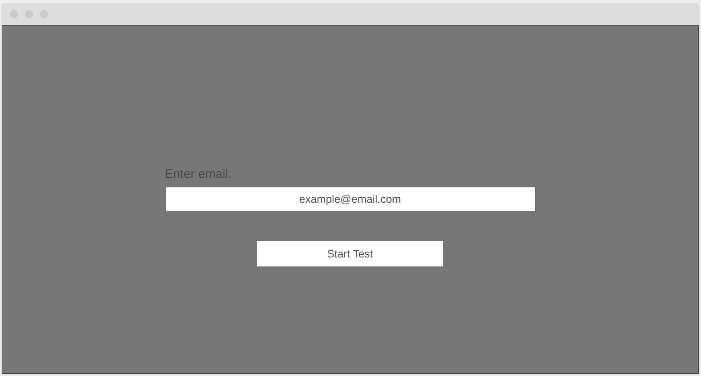
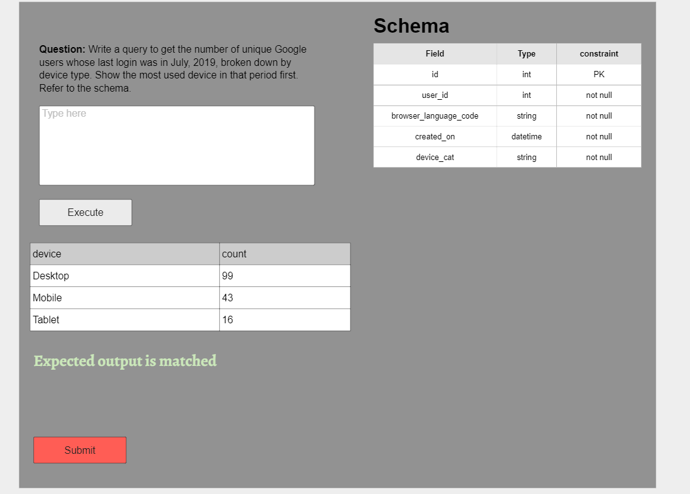

# SQL query tester
## About This Project
### Features
- Table schemas for questions are generated automatically from answer_as_query's.
- Single command to dump all secondary_table data and initialize roles `flask db_custom seed_secondary_tables`.
- Reactive and Stateful front end using ReactJs.
- single command `docker compose up` to bring up a development environment without worry about dependencies.

### How to deploy your own
#### Docker Compose
If you do not want to go through the effort of installing dependencies (aside from docker) and only want to use this app in a development environment. Simply run: `docker compose up` from the command line and navigate to `localhost:9090` in a browser of your choice.

#### Full Fleged Deployment
- [FrontEnd](./front-end)
- [BackEnd](./back-end)

### Live deployment
https://sqltestapp.ml

## Planning documentation
## Main Database

## Wire Frames

### Api documentation
https://editor.swagger.io/?url=https://raw.githubusercontent.com/mo-ccc/sql-query-test-application/master/docs/swagger.yml

### Scrumban board
https://trello.com/b/MnSlqP47/sql-query-test-application

## Original Plan
1. When a user enters an email, main database is updated with a new `user` record and a new `test` record.
2. The test becomes accessible through the client as long as `test` record exists and has not been submitted.
3. User enters a query and presses execute causing `answer_as_query` to run on the question database alongside the user entered query. 
4. The two results are compared. If the results from the user entered query matches the `answer_as_query` results: the server will return that user has the right answer. query outcome is returned regardless.
5. User submits query. The query the user submitted is saved along with the time the user submitted the query and the result (either 0 or 1).
6. User is redirected to homepage with a thank you message.
