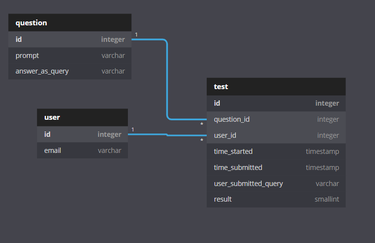

# SQL query tester
## Main Database

## Plan
- Have a main database which will contain all user data.
- Have a question database that will handle testing specifically.

1. When user enters email main database is updated with a new `user` record and new `test` record tied to the users account info.
2. Test becomes accessible as long as `test` record exists and has not been submitted.
3. User enters a query. answer_as_query runs on question database alongside user entered query. The two results are compared. If the results from the user entered query matches the `answer_as_query` results: server will return that user has the right answer. query outcome is returned regardless.
4. User submits query. The query the user submitted is saved along with the time the user submitted the query and the result (either 0 or 1).
5. User is redirected to homepage.

